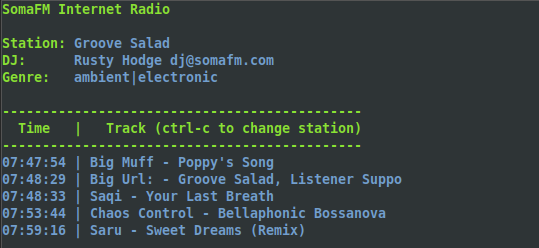
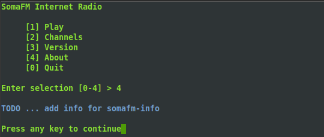

# SomaFM

A menu based command line interface streaming music player for the [SomaFM](https://somafm.com/ "https://somafm.com") online broadcasting service. 

<a href="https://somafm.com/"></a>


## Install
Assumes Debian based Linux distribution with `apt` package manager, use your specific distribution package manager for dependency installation. Dependencies are `mpv` media player and `jq` JSON filter. Version control package `git` is optional but will allow you to clone, copy and modify the application if desired. It is recommended to install `soma` in a directory such as `/usr/local/bin` included in your system `$PATH`.

```console
$ cd ~
$ sudo apt update
$ sudo apt install git mpv jq
$ git clone git@github.com:efranzwa/SomaFM.git
$ sudo cp SomaFM/src/soma /usr/local/bin
```

Another way to install is to copy the `soma` file directly from repository.
```console
$ cd ~
$ wget https://raw.githubusercontent.com/efranzwa/SomaFM/src/soma
$ sudo cp soma /usr/local/bin
```

## Play Channel
Just execute `soma` command. No parameters or options are needed. Play a channel with `1` and enter channel name and quality. To play default channel (Groove Salad) at default quality (high), select `1`, `Enter`, `Enter`. To change channel press `ctrl-c` at any time to return to menu. Need a list of available channels? See next section.

```console
$ soma
```




## List Channels
Execute `soma` command. Display a list of currently available channels with `2`. Note that the SomaFM channels information file will be saved to your home directory as `channels.json`.

```console
$ soma
```


## Check Version

Execute `soma` command. Display version of SomaFM with `3`.
```console
$ soma
```


## About

Execute `soma` command. Display information about SomaFM with `4`.
```console
$ soma
```

# SomaFM